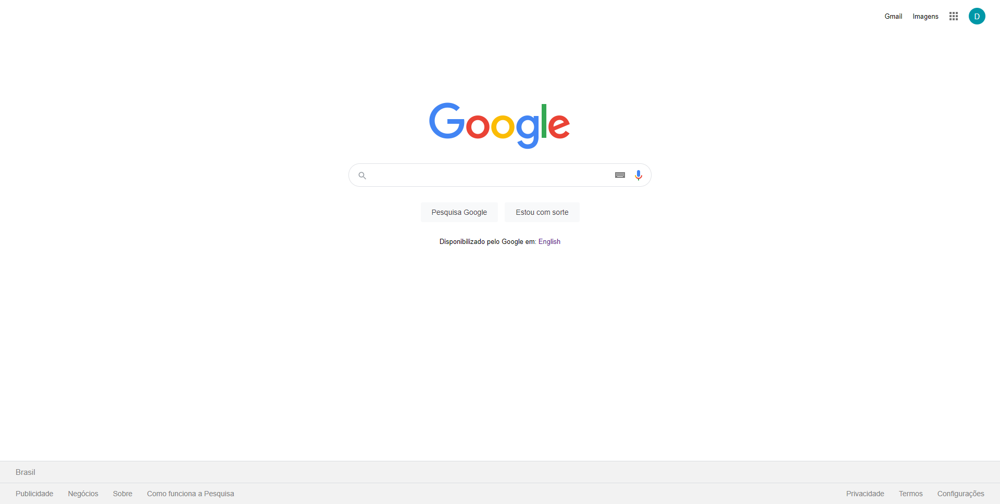
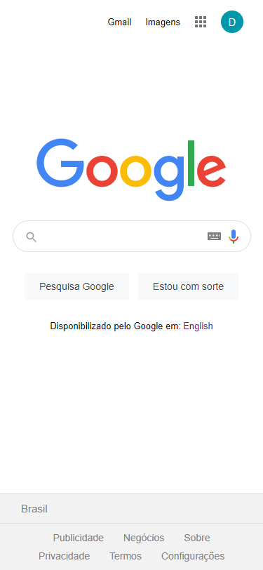

<h1 align="Center">Google Page</h1>

<h1></h1>
<h2>Descrição</h2>

Essa é a minha solução para um exercício do curso de HTML e CSS da B7Web, O desafio era clonar a página principal do google, Tentei deixar o mais parecido possível com a original. 

<h2>Tecnologias usadas</h2>
<ul>
    <li>HTML</li>
    <li>CSS</li>
</ul>
<h1></h1>
<h2 align="center">
    <a href="https://grazziotti.github.io/google-page/">Acessar a página</a>
</h2>

